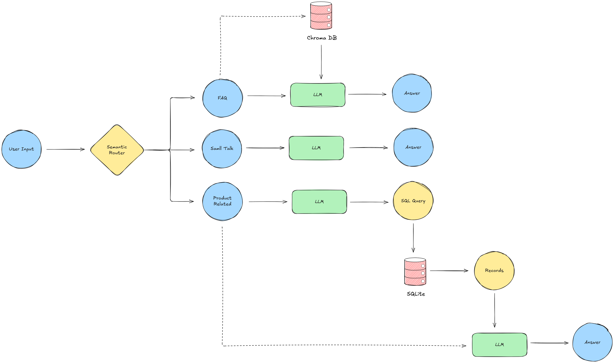

# 💬E-Commerce Chatbot

This is a **Proof of Concept (POC)** for an intelligent chatbot designed for an e-commerce platform. The chatbot enables seamless user interactions by accurately identifying the intent behind user queries. It leverages real-time access to the platform's database, allowing it to provide precise and up-to-date responses.

This chatbot currently supports three intents:

**1. faq**: Handles frequently asked questions related to the platform's policies or general information.
> _"Is online payment available?"_


**2. sql**: Activated when users request product listings or information based on real-time database queries.
> _"Show me all Nike shoes below Rs. 3000."_


**3. smalltalk**: Responds to casual or conversational messages to make the chatbot more engaging and human-like.
> _"How are you?"_  

## 💡 Key Features

- Intent classification using NLP
- Real-time database querying
- Friendly and interactive small talk capabilities

## Data Collection


## Technical Architecture



## Installation

1. **Clone the repository**:

```
git clone https://github.com/lintosunny/ecommerce-chatbot.git
```

2. **Create and activate a virtual environment (optional but recommended)**:

```
conda create -n env python=3.10 -y
```

```
conda activate env
```

3. **Install Dependencies**:

```
pip install -r requirements.txt
```

4. **Setup your API Key**:

Create a ```.env``` file in the root directory and add your Groq API key:

```
GROQ_API_KEY=your_groq_api_key_here
```

5. **Run the App**
```
streamlit run src/main.py
```
Once started app will be open in your default web browser.

## Getting Help

* Issues: Report bugs on GitHub Issues
* Discussions: Use GitHub Discussions for questions
* Contact: lintosunny111@gmail.com

## Contribution
Feel free to contribute or adapt the chatbot to your own platform!

## License
This project is licensed under the MIT License 


